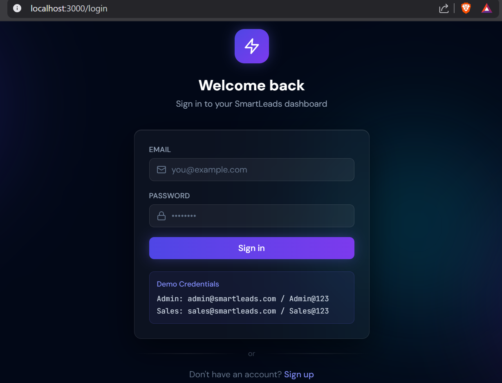
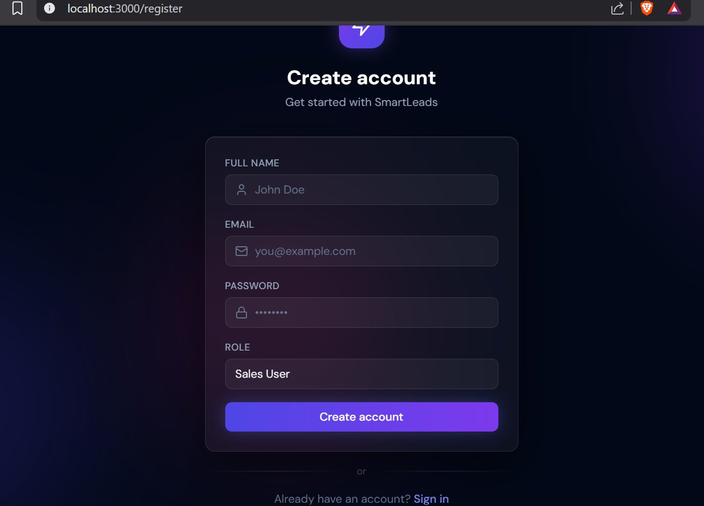
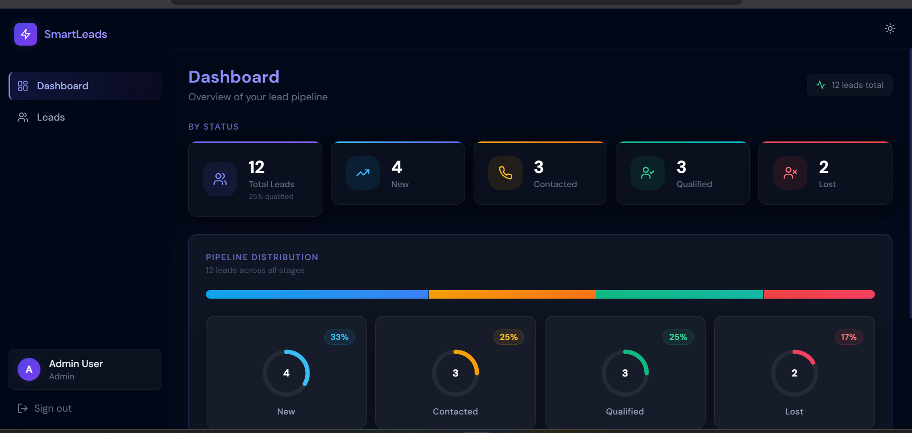
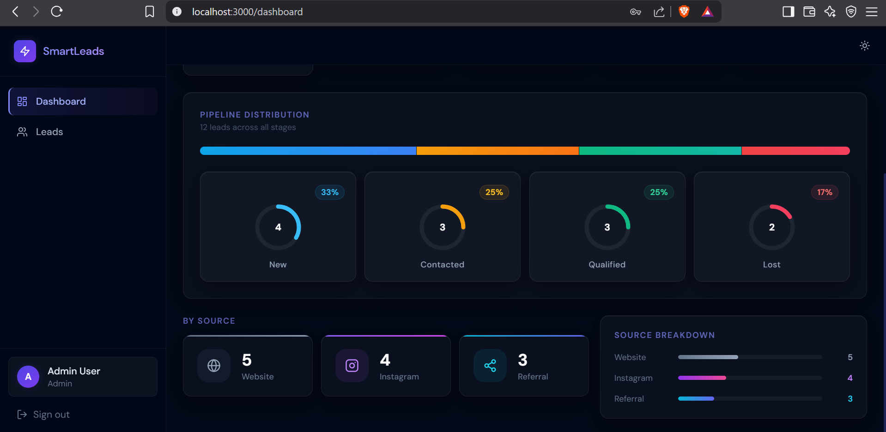
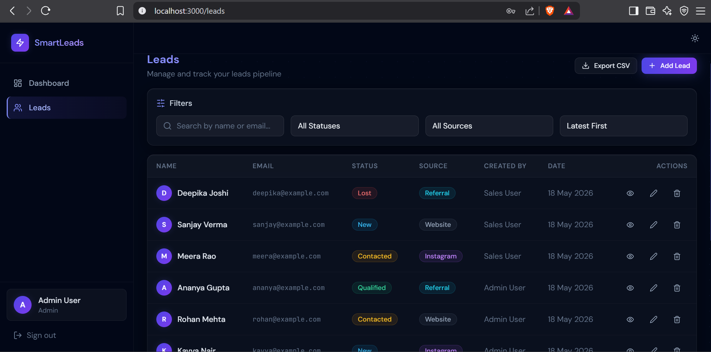
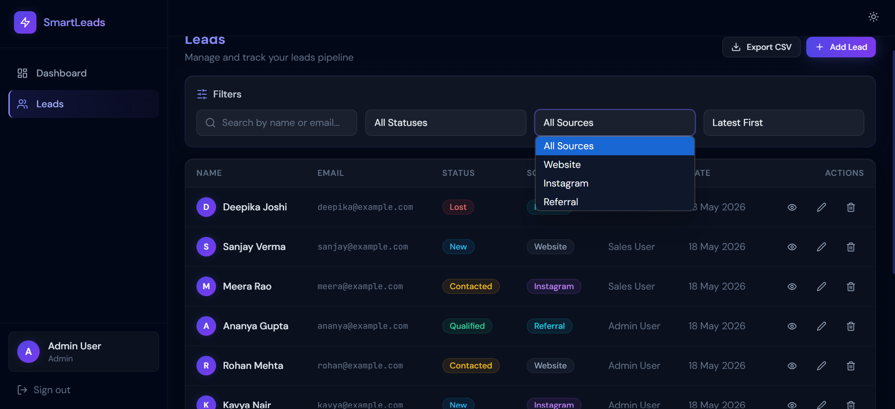
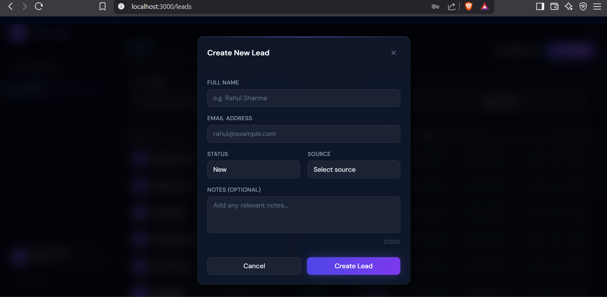
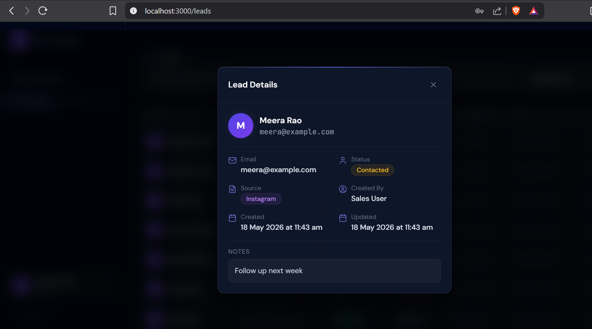
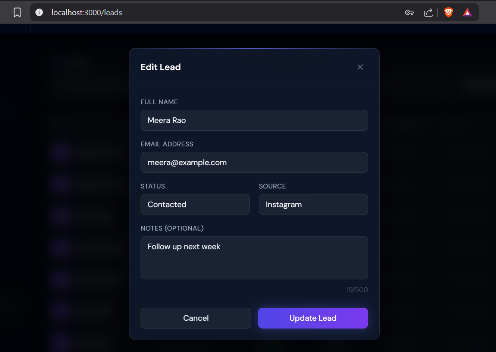
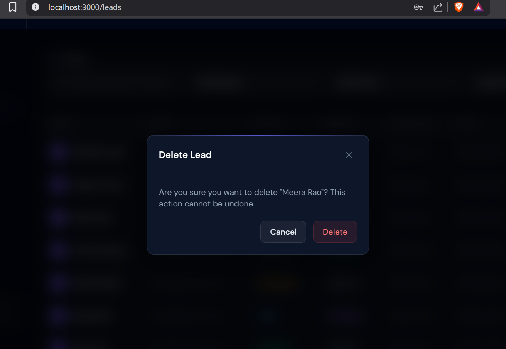

# Smart Leads Dashboard

> A full-stack **Lead Management System** built as part of a Full-Stack Developer Internship Assignment.
> Built with the **MERN stack** (MongoDB, Express, React, Node.js) — **100% TypeScript**, no plain JavaScript.

## Live Demo

| | URL |
|---|---|
| **Live App** | https://smart-lead-dashboard-1-qvvp.onrender.com |
| **Backend API** | https://smart-lead-dashboard-lv36.onrender.com |

**Demo Credentials:**

| Role | Email | Password |
|---|---|---|
| Admin | admin@smartleads.com | Admin@123 |
| Sales User | sales@smartleads.com | Sales@123 |

> **Note:** Render's free tier spins down after 15 mins of inactivity. The first load after inactivity takes ~30 seconds to wake up. That's normal on the free plan.


---

## What Was Asked (Assignment Requirements)

The assignment asked to build a **Lead Management Dashboard** for a sales team. Here is what was required:

| Requirement | Status |
|---|---|
| Full-stack MERN app with TypeScript everywhere | ✅ Done |
| User authentication (Login / Register) with JWT | ✅ Done |
| Role-based access — Admin and Sales User roles | ✅ Done |
| Full CRUD for leads (Create, Read, Update, Delete) | ✅ Done |
| Filter leads by status, source, and search | ✅ Done |
| Pagination for the leads list | ✅ Done |
| Dashboard with lead statistics | ✅ Done |
| CSV export of leads (Admin only) | ✅ Done |
| Docker setup for containerised deployment | ✅ Done |
| Clean project structure and code quality | ✅ Done |

---

## What I Built

In simple terms, this is a **web app where a sales team can track their potential customers (leads)**.

- A salesperson can **log in**, **add new leads**, and **update their status** as they follow up.
- An **Admin** can see all leads from every salesperson, export them to Excel/CSV, and manage users.
- A **Sales User** only sees and manages their own leads.
- The **Dashboard** gives a visual overview — how many leads are New, Contacted, Qualified, or Lost, and where they came from (Website, Instagram, Referral).

### How the App Works

```
User opens the app
   → Logs in (JWT token saved)
   → Sees Dashboard with stats + pipeline chart
   → Goes to Leads page
      → Can filter/search leads
      → Can create a new lead
      → Can view, edit, or delete a lead
      → Admin can export all leads as CSV
```

### Technical Decisions I Made

| Decision | Why |
|---|---|
| **Zustand** for auth state | Simpler than Redux, zero boilerplate |
| **React Query** for server data | Handles caching, loading/error states automatically |
| **express-validator** for validation | Clean, declarative validation on the backend |
| **Winston** for logging | Structured logs, writes to files in production |
| **Vite** instead of Create React App | Much faster dev server and builds |
| **TailwindCSS** with glassmorphism design | Dark theme with frosted glass UI components |

---

## Screenshots

> **To add screenshots:** Run the app locally, take screenshots of each page/feature listed below, and save them in a `screenshots/` folder in the project root with the exact filenames shown.

### 1. Login Page

> *The login screen with animated background orbs and demo credentials box.*

### 2. Register Page

> *Registration form with name, email, password, and role selection.*

### 3. Dashboard — Overview

> *Stat cards showing Total, New, Contacted, Qualified, and Lost leads.*

### 4. Dashboard — Pipeline Distribution

> *Segmented bar chart + ring/donut charts for each lead status.*

### 5. Leads Table

> *Full leads list with status badges, source badges, action buttons.*

### 6. Leads Table — Filters Active

> *Filter bar with status/source dropdowns and search input active.*

### 7. Create New Lead

> *Modal form with name, email, status, source, and notes fields.*

### 8. View Lead Details

> *Detail modal showing all lead info with created/updated timestamps.*

### 9. Edit Lead

> *Pre-filled edit form for updating an existing lead.*

### 10. Delete Confirmation

> *Confirmation dialog before permanently deleting a lead.*

---

## Project Structure

```
smart-leads-dashboard/
├── docker-compose.yml         # Runs MongoDB + backend + frontend together
├── .env.example               # Root env template for Docker
├── .gitignore
├── README.md
│
├── backend/                   # Node.js + Express API
│   ├── Dockerfile
│   ├── package.json
│   ├── tsconfig.json
│   ├── .env.example
│   └── src/
│       ├── server.ts          # Entry point — starts the HTTP server
│       ├── app.ts             # Express setup, middleware, routes
│       ├── config/
│       │   └── database.ts    # MongoDB connection logic
│       ├── controllers/
│       │   ├── authController.ts   # Login, register, getMe
│       │   └── leadsController.ts  # All lead operations + stats + CSV
│       ├── middleware/
│       │   ├── auth.ts             # JWT verification + role checks
│       │   └── errorHandler.ts     # Global error handler
│       ├── models/
│       │   ├── User.ts             # User schema (bcrypt password hashing)
│       │   └── Lead.ts             # Lead schema with DB indexes
│       ├── routes/
│       │   ├── auth.ts
│       │   ├── leads.ts
│       │   └── users.ts
│       ├── types/
│       │   └── index.ts            # All backend TypeScript interfaces
│       ├── utils/
│       │   ├── logger.ts           # Winston logger
│       │   ├── response.ts         # Standardised API response helpers
│       │   └── seed.ts             # Seeds demo users and leads
│       └── validators/
│           └── index.ts            # express-validator validation rules
│
└── frontend/                  # React + Vite app
    ├── Dockerfile
    ├── nginx.conf
    ├── package.json
    ├── tsconfig.json
    ├── tailwind.config.js
    ├── vite.config.ts
    ├── .env.example
    └── src/
        ├── main.tsx               # React root + React Query + Toast setup
        ├── App.tsx                # Client-side routing (public/private)
        ├── index.css              # Tailwind + glass design system
        ├── api/
        │   ├── client.ts          # Axios instance with JWT interceptors
        │   ├── auth.ts            # Auth API calls
        │   └── leads.ts           # Leads API calls
        ├── components/
        │   ├── layout/
        │   │   └── DashboardLayout.tsx    # Sidebar + header shell
        │   ├── dashboard/                 # Dashboard-specific components
        │   │   ├── StatCard.tsx           # Stat card with accent top bar
        │   │   ├── RingCard.tsx           # Donut ring chart card
        │   │   └── MetricBar.tsx          # Horizontal bar metric row
        │   ├── leads/
        │   │   ├── LeadFiltersBar.tsx     # Search + filter dropdowns
        │   │   ├── LeadForm.tsx           # Create/edit lead form
        │   │   ├── LeadDetailModal.tsx    # View lead details
        │   │   ├── LeadsTable.tsx         # Leads data table
        │   │   ├── Pagination.tsx         # Page navigation
        │   │   └── StatusBadge.tsx        # Status + source badge components
        │   └── ui/                        # Reusable UI component library
        │       ├── index.tsx              # Barrel export (imports from below)
        │       ├── Button.tsx
        │       ├── Input.tsx
        │       ├── Select.tsx
        │       ├── Badge.tsx
        │       ├── Modal.tsx
        │       ├── Spinner.tsx
        │       ├── EmptyState.tsx
        │       └── ConfirmDialog.tsx
        ├── contexts/
        │   └── authStore.ts       # Zustand store — user, token, login/logout
        ├── hooks/
        │   ├── useDebounce.ts     # Debounce hook for search input
        │   └── useLeads.ts        # React Query hooks for all lead operations
        ├── pages/
        │   ├── DashboardPage.tsx
        │   ├── LeadsPage.tsx
        │   ├── LoginPage.tsx
        │   └── RegisterPage.tsx
        ├── types/
        │   └── index.ts           # All shared frontend TypeScript types
        └── utils/
            └── date.ts            # Shared date formatting helpers
```

---

## Quick Start (Run Locally)

### What you need installed
- Node.js 18 or higher
- MongoDB running locally (or a free MongoDB Atlas account)
- npm

### Step 1 — Backend

```bash
cd backend
cp .env.example .env
# Open .env and set MONGODB_URI and JWT_SECRET
npm install
npm run seed      # Creates demo users and sample leads
npm run dev       # API runs on http://localhost:5000
```

### Step 2 — Frontend

```bash
cd frontend
cp .env.example .env
# VITE_API_URL is already set to http://localhost:5000/api
npm install
npm run dev       # App opens on http://localhost:5173
```

### Demo Login Credentials

| Role | Email | Password |
|---|---|---|
| Admin | admin@smartleads.com | Admin@123 |
| Sales User | sales@smartleads.com | Sales@123 |

---

## Docker Setup (Optional)

Run everything (MongoDB + backend + frontend) with one command:

```bash
# From the root directory
cp .env.example .env      # Set JWT_SECRET at minimum
docker-compose up --build
```

| Service | URL |
|---|---|
| Frontend | http://localhost |
| Backend API | http://localhost:5000/api |
| Health Check | http://localhost:5000/health |

Seed demo data inside Docker:

```bash
docker exec -it smartleads-backend node dist/utils/seed.js
```

---

## Deployment Guide

### Backend → Railway or Render (free)

1. Push this repo to GitHub
2. Go to [railway.app](https://railway.app) or [render.com](https://render.com) → New Web Service
3. Connect your GitHub repo, set root directory to `backend`
4. Build command: `npm run build` | Start command: `npm start`
5. Add these environment variables:

```
NODE_ENV=production
MONGODB_URI=<your MongoDB Atlas URI>
JWT_SECRET=<any long random string>
FRONTEND_URL=<your Vercel/Netlify URL>
```

### Frontend → Vercel (free, recommended)

1. Go to [vercel.com](https://vercel.com) → New Project → Import from GitHub
2. Set root directory to `frontend`
3. Build command: `npm run build` | Output directory: `dist`
4. Add this environment variable:

```
VITE_API_URL=<your Railway/Render backend URL>/api
```

---

## API Reference

### Base URL: `/api`

#### Auth Endpoints

| Method | Endpoint | Description | Protected |
|---|---|---|---|
| POST | `/auth/register` | Create a new account | No |
| POST | `/auth/login` | Login, returns JWT | No |
| GET | `/auth/me` | Get logged-in user info | Yes |

#### Lead Endpoints

| Method | Endpoint | Description | Protected |
|---|---|---|---|
| GET | `/leads` | Get leads (paginated + filtered) | Yes |
| POST | `/leads` | Create a new lead | Yes |
| GET | `/leads/:id` | Get one lead | Yes |
| PUT | `/leads/:id` | Update a lead | Yes |
| DELETE | `/leads/:id` | Delete a lead | Yes |
| GET | `/leads/stats` | Dashboard statistics | Yes |
| GET | `/leads/export` | Download CSV file | Admin only |

#### Query Parameters for `GET /leads`

| Param | Type | Example |
|---|---|---|
| `page` | number | `?page=2` |
| `limit` | number | `?limit=10` |
| `status` | string | `?status=New` |
| `source` | string | `?source=Instagram` |
| `search` | string | `?search=rahul` |
| `sort` | string | `?sort=latest` or `?sort=oldest` |

#### Standard API Response Shape

```json
{
  "success": true,
  "message": "Leads retrieved successfully",
  "data": [],
  "pagination": {
    "currentPage": 1,
    "totalPages": 3,
    "totalItems": 25,
    "itemsPerPage": 10,
    "hasNextPage": true,
    "hasPrevPage": false
  }
}
```

---

## Role Permissions

| Action | Admin | Sales User |
|---|---|---|
| View all leads | ✅ | ❌ own leads only |
| Create leads | ✅ | ✅ |
| Edit leads | ✅ all | ❌ own only |
| Delete leads | ✅ all | ❌ own only |
| Export CSV | ✅ | ❌ |
| Dashboard stats | ✅ all leads | ✅ own leads |
| Manage users | ✅ | ❌ |

---

## Environment Variables

### Backend (`backend/.env`)

| Variable | Description | Default |
|---|---|---|
| `NODE_ENV` | `development` or `production` | `development` |
| `PORT` | Port the API runs on | `5000` |
| `MONGODB_URI` | MongoDB connection string | `mongodb://localhost:27017/smart-leads` |
| `JWT_SECRET` | Secret key for signing JWTs | *(required)* |
| `JWT_EXPIRES_IN` | How long tokens last | `7d` |
| `FRONTEND_URL` | Allowed CORS origin | `http://localhost:3000` |

### Frontend (`frontend/.env`)

| Variable | Description | Default |
|---|---|---|
| `VITE_API_URL` | Backend API base URL | `http://localhost:5000/api` |

---

## License

MIT
